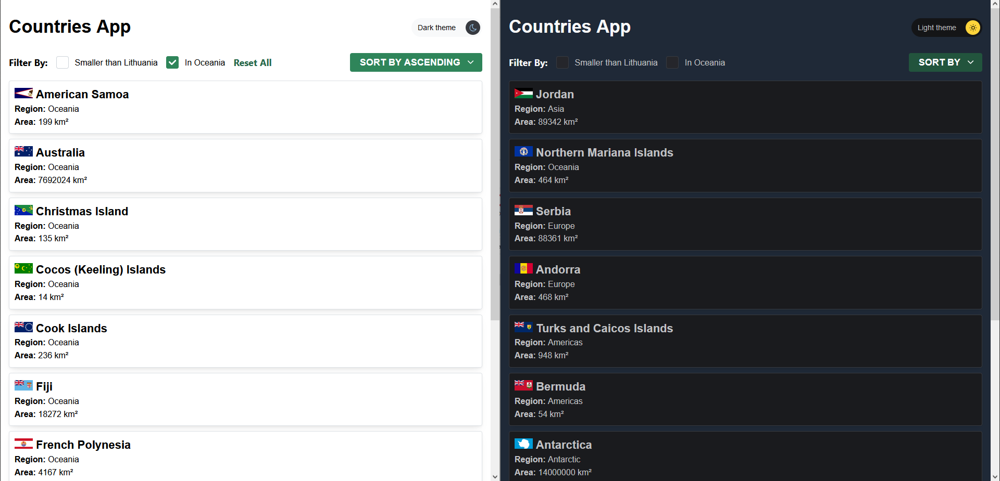

# Countries App
#### <a href="https://countries-app-kmi.vercel.app/">Link of the Project</a>
## Description
This is a web application that displays a list of countries, by their name, region, and area size. Users can sort the list alphabetically by name and apply filters to check countries that are smaller than Lithuania by area or located in the "Oceania" region. Additionally, the app provides a Dark theme to Light theme button for a personalized viewing experience.

## Preview

## Features
- Fetches country data from the [restcountries.com](https://restcountries.com) API.
- Displays a list of countries with their name, region, and area size.
- Allows sorting the list alphabetically by name in ascending or descending order.
- Provides filters to display countries smaller than Lithuania by area or in the "Oceania" region.
- Supports pagination for easier navigation through the country list.
- Offers a Dark theme to Light theme button.

## Technologies Used
- React.js: A modern JavaScript library for building user interfaces.
- Axios: A promise-based HTTP client for making API requests.
- JavaScript: A programming language that enhances code quality and development experience.

## Installation
1. Clone the repository:
<code>git clone https://github.com/CamilaNieto-Centennial/CountriesApp.git</code>

2. Navigate to the project directory:
<code>cd countries-app</code>

3. Install the dependencies:
<code>npm install</code>

4. Start the development server:
<code>npm start</code>

5. Open your browser and visit [http://localhost:3000](http://localhost:3000) to check the app.

## Usage
- Click on the column headers to sort the country list alphabetically by name.
- Check the "Smaller than Lithuania" checkbox to filter countries smaller than Lithuania by area.
- Check the "Oceania" checkbox to filter countries in the "Oceania" region.
- Use the pagination controls at the bottom of the page to navigate through the country list.
- Click the Dark theme/Light theme button to switch between the dark and light themes.

## License
This project is licensed under the MIT License. See the [LICENSE](LICENSE) file for more details.